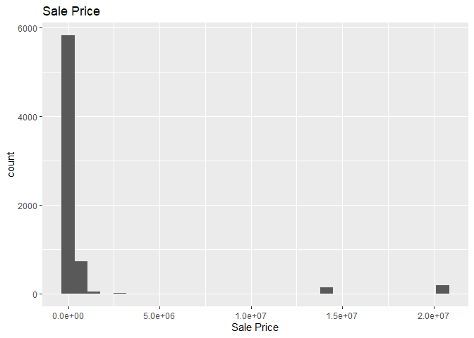
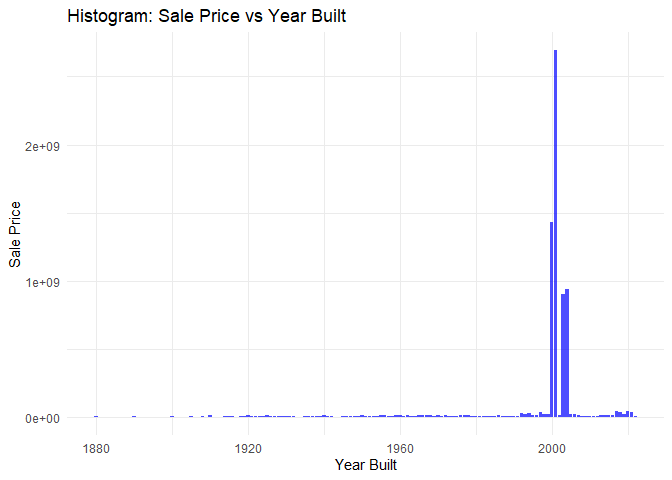

<!-- README.md is generated from README.Rmd. Please edit the README.Rmd file -->

# Lab report \#2

Follow the instructions posted at
<https://ds202-at-isu.github.io/labs.html> for the lab assignment. The
work is meant to be finished during the lab time, but you have time
until Monday evening to polish things.

Include your answers in this document (Rmd file). Make sure that it
knits properly (into the md file). Upload both the Rmd and the md file
to your repository.

All submissions to the github repo will be automatically uploaded for
grading once the due date is passed. Submit a link to your repository on
Canvas (only one submission per team) to signal to the instructors that
you are done with your submission.

``` r
#remotes::install_github("heike/classdata")
library(classdata)
library(ggplot2)
```

``` r
head(ames)
```

    ## # A tibble: 6 × 16
    ##   `Parcel ID` Address      Style Occupancy `Sale Date` `Sale Price` `Multi Sale`
    ##   <chr>       <chr>        <fct> <fct>     <date>             <dbl> <chr>       
    ## 1 0903202160  1024 RIDGEW… 1 1/… Single-F… 2022-08-12        181900 <NA>        
    ## 2 0907428215  4503 TWAIN … 1 St… Condomin… 2022-08-04        127100 <NA>        
    ## 3 0909428070  2030 MCCART… 1 St… Single-F… 2022-08-15             0 <NA>        
    ## 4 0923203160  3404 EMERAL… 1 St… Townhouse 2022-08-09        245000 <NA>        
    ## 5 0520440010  4507 EVERES… <NA>  <NA>      2022-08-03        449664 <NA>        
    ## 6 0907275030  4512 HEMING… 2 St… Single-F… 2022-08-16        368000 <NA>        
    ## # ℹ 9 more variables: YearBuilt <dbl>, Acres <dbl>,
    ## #   `TotalLivingArea (sf)` <dbl>, Bedrooms <dbl>,
    ## #   `FinishedBsmtArea (sf)` <dbl>, `LotArea(sf)` <dbl>, AC <chr>,
    ## #   FirePlace <chr>, Neighborhood <fct>

There are 16 variables in the Ames data set. Some variables are
categorical and others are numerical.

``` r
str(ames)
```

    ## tibble [6,935 × 16] (S3: tbl_df/tbl/data.frame)
    ##  $ Parcel ID            : chr [1:6935] "0903202160" "0907428215" "0909428070" "0923203160" ...
    ##  $ Address              : chr [1:6935] "1024 RIDGEWOOD AVE, AMES" "4503 TWAIN CIR UNIT 105, AMES" "2030 MCCARTHY RD, AMES" "3404 EMERALD DR, AMES" ...
    ##  $ Style                : Factor w/ 12 levels "1 1/2 Story Brick",..: 2 5 5 5 NA 9 5 5 5 5 ...
    ##  $ Occupancy            : Factor w/ 5 levels "Condominium",..: 2 1 2 3 NA 2 2 1 2 2 ...
    ##  $ Sale Date            : Date[1:6935], format: "2022-08-12" "2022-08-04" ...
    ##  $ Sale Price           : num [1:6935] 181900 127100 0 245000 449664 ...
    ##  $ Multi Sale           : chr [1:6935] NA NA NA NA ...
    ##  $ YearBuilt            : num [1:6935] 1940 2006 1951 1997 NA ...
    ##  $ Acres                : num [1:6935] 0.109 0.027 0.321 0.103 0.287 0.494 0.172 0.023 0.285 0.172 ...
    ##  $ TotalLivingArea (sf) : num [1:6935] 1030 771 1456 1289 NA ...
    ##  $ Bedrooms             : num [1:6935] 2 1 3 4 NA 4 5 1 3 4 ...
    ##  $ FinishedBsmtArea (sf): num [1:6935] NA NA 1261 890 NA ...
    ##  $ LotArea(sf)          : num [1:6935] 4740 1181 14000 4500 12493 ...
    ##  $ AC                   : chr [1:6935] "Yes" "Yes" "Yes" "Yes" ...
    ##  $ FirePlace            : chr [1:6935] "Yes" "No" "No" "No" ...
    ##  $ Neighborhood         : Factor w/ 42 levels "(0) None","(13) Apts: Campus",..: 15 40 19 18 6 24 14 40 13 23 ...

**Variable Type:**

Parcel ID: Character

Address: Character

Style: Factor

Occupancy: Factor

Sale Date: Date

Sale Price: Double

Multi Sale: Character

Year Built: Double

Acres: Double

Total Living Area: Double

Bedrooms: Double

Finished Basement Area: Double

Lot Area: Double

AC: Character

Fireplace: Character

Neighborhood: Factor

**Meaning of Variable:**

Parcel ID:  
character with ID.

Address:  
property address in Ames, IA.

Style:  
factor variable detailing the type of housing.

Occupancy:  
factor variable of type of housing.

Sale Date:  
date of sale.

Sale Price:  
sales price (in US dollar).

Multi Sale:  
logical value: was this sale part of a package?

YearBuilt:  
integer value: year in which the house was built.

Acres:  
acres of the lot.

TotalLivingArea (sf):  
total living area in square feet.

Bedrooms:  
number of bedrooms.

FinishedBsmtArea (sf):  
total area of the finished basement in square feet.

LotArea(sf):  
total lot area in square feet.

AC:  
logical value: does the property have an AC?

FirePlace:  
logical value: does the property have an fireplace?

Neighborhood:  
factor variable - levels indicate neighborhood area in Ames.

**Expected Range:**

This can be found in the summary output by subtracting the minimum from
the maximum values for each applicable variable (some variable types do
not have a range) in the summary output.

**Question 2)**

**is there a variable of special interest or focus?**

The special variable of focus is the sale price of the
house/condo/apartment in USD.

**Question 3)**

**start the exploration with the main variable:**

- **what is the range of the variable? draw a histogram for a numeric
  variable or a bar chart, if the variable is categorical. what is the
  general pattern? is there anything odd?**

- **follow-up on oddities: see 4**

``` r
max(ames$`Sale Price`,na.rm=TRUE)-min(ames$`Sale Price`,na.rm=TRUE)
```

    ## [1] 20500000

The range for the sale price is 20500000 USD.

``` r
ggplot(ames, aes(x = `Sale Price`)) + 
  geom_histogram() +
  ggtitle("Sale Price")
```

    ## `stat_bin()` using `bins = 30`. Pick better value with `binwidth`.

<!-- -->

There is a lot of variance and a few outliers as there is large cluster
near the y axis and a few outliers as you move right.

**Question 4)**

**pick a variable that might be related to the main variable.**

- **what is the range of that variable? plot. describe the pattern.**

- **what is the relationship to the main variable? plot a scatterplot,
  boxplot or facetted barcharts (dependening on the types of variables
  involved). Describe overall pattern, does this variable describe any
  oddities discovered in 3? Identify/follow-up on any oddities.**

**Cassie Bedrooms:**

``` r
max(ames$`Bedrooms`,na.rm=TRUE)-min(ames$`Bedrooms`,na.rm=TRUE)
```

    ## [1] 10

``` r
max(ames$`Bedrooms`,na.rm=TRUE)
```

    ## [1] 10

``` r
min(ames$`Bedrooms`,na.rm=TRUE)
```

    ## [1] 0

The range of Bedrooms is 10.

``` r
ggplot(data = ames, aes(x = factor(`Bedrooms`) , y = `Sale Price`)) +
  geom_boxplot()
```

<!-- -->

This box-plot shows that there is not a large correlation between number
of bedrooms and sale price. It would likely be better if it was included
as a variable in a multiple linear regression to identify how exactly it
impacts (or doesn’t) impact sale price. This is likely because other
factors have a more signifcant impact on the sale price.

``` r
#Ryan Riebesehl- I chose Acres
# remotes::install_github('heike/classdata')
library(classdata)
head(ames)
```

    ## # A tibble: 6 × 16
    ##   `Parcel ID` Address      Style Occupancy `Sale Date` `Sale Price` `Multi Sale`
    ##   <chr>       <chr>        <fct> <fct>     <date>             <dbl> <chr>       
    ## 1 0903202160  1024 RIDGEW… 1 1/… Single-F… 2022-08-12        181900 <NA>        
    ## 2 0907428215  4503 TWAIN … 1 St… Condomin… 2022-08-04        127100 <NA>        
    ## 3 0909428070  2030 MCCART… 1 St… Single-F… 2022-08-15             0 <NA>        
    ## 4 0923203160  3404 EMERAL… 1 St… Townhouse 2022-08-09        245000 <NA>        
    ## 5 0520440010  4507 EVERES… <NA>  <NA>      2022-08-03        449664 <NA>        
    ## 6 0907275030  4512 HEMING… 2 St… Single-F… 2022-08-16        368000 <NA>        
    ## # ℹ 9 more variables: YearBuilt <dbl>, Acres <dbl>,
    ## #   `TotalLivingArea (sf)` <dbl>, Bedrooms <dbl>,
    ## #   `FinishedBsmtArea (sf)` <dbl>, `LotArea(sf)` <dbl>, AC <chr>,
    ## #   FirePlace <chr>, Neighborhood <fct>

``` r
#Ryan Riebesehl- I chose Acres:

library(ggplot2)
ames1 <- na.omit(ames)
Acres <- ames1$Acres
SalePrice <- ames1$`Sale Price`
print(range(Acres))
```

    ## [1] 0.096 1.222

``` r
ggplot(ames1, aes(x = Acres, y = SalePrice)) +
  geom_point(size = 3, alpha = 0.8) +
  labs(title = "Scatterplot of Sale Price against Related Variable",
       x = "Acres",
       y = "Sale Price",
       color = "Category") +
  theme_minimal()
```

<!-- -->

^Based on the scatter plot to see differences between Acres and Sales
Price, you can see a slight trend that houses with small acres have an
expensive sales price. This is the same for houses with large amounts
Acres. This is probably because houses near the downtown city of Ames
tend to be more expensive. Additionally, large acres of land will
usually cost more money. There are some oddities in the graph as some
price have not been updated. -Ryan Riebesehl

``` r
library(ggplot2)
ames
```

    ## # A tibble: 6,935 × 16
    ##    `Parcel ID` Address     Style Occupancy `Sale Date` `Sale Price` `Multi Sale`
    ##    <chr>       <chr>       <fct> <fct>     <date>             <dbl> <chr>       
    ##  1 0903202160  1024 RIDGE… 1 1/… Single-F… 2022-08-12        181900 <NA>        
    ##  2 0907428215  4503 TWAIN… 1 St… Condomin… 2022-08-04        127100 <NA>        
    ##  3 0909428070  2030 MCCAR… 1 St… Single-F… 2022-08-15             0 <NA>        
    ##  4 0923203160  3404 EMERA… 1 St… Townhouse 2022-08-09        245000 <NA>        
    ##  5 0520440010  4507 EVERE… <NA>  <NA>      2022-08-03        449664 <NA>        
    ##  6 0907275030  4512 HEMIN… 2 St… Single-F… 2022-08-16        368000 <NA>        
    ##  7 0535105180  511 25TH S… 1 St… Single-F… 2022-08-03             0 <NA>        
    ##  8 0907428446  4510 TWAIN… 1 St… Condomin… 2022-08-16        110000 <NA>        
    ##  9 0527301030  3409 EISEN… 1 St… Single-F… 2022-08-08        350000 <NA>        
    ## 10 0531363050  5426 KANSA… 1 St… Single-F… 2022-08-03        242000 <NA>        
    ## # ℹ 6,925 more rows
    ## # ℹ 9 more variables: YearBuilt <dbl>, Acres <dbl>,
    ## #   `TotalLivingArea (sf)` <dbl>, Bedrooms <dbl>,
    ## #   `FinishedBsmtArea (sf)` <dbl>, `LotArea(sf)` <dbl>, AC <chr>,
    ## #   FirePlace <chr>, Neighborhood <fct>

``` r
# View(ames)
library(tidyverse)
```

    ## ── Attaching core tidyverse packages ──────────────────────── tidyverse 2.0.0 ──
    ## ✔ dplyr     1.1.4     ✔ readr     2.1.5
    ## ✔ forcats   1.0.0     ✔ stringr   1.5.1
    ## ✔ lubridate 1.9.3     ✔ tibble    3.2.1
    ## ✔ purrr     1.0.2     ✔ tidyr     1.3.1
    ## ── Conflicts ────────────────────────────────────────── tidyverse_conflicts() ──
    ## ✖ dplyr::filter() masks stats::filter()
    ## ✖ dplyr::lag()    masks stats::lag()
    ## ℹ Use the conflicted package (<http://conflicted.r-lib.org/>) to force all conflicts to become errors

``` r
str(ames)
```

    ## tibble [6,935 × 16] (S3: tbl_df/tbl/data.frame)
    ##  $ Parcel ID            : chr [1:6935] "0903202160" "0907428215" "0909428070" "0923203160" ...
    ##  $ Address              : chr [1:6935] "1024 RIDGEWOOD AVE, AMES" "4503 TWAIN CIR UNIT 105, AMES" "2030 MCCARTHY RD, AMES" "3404 EMERALD DR, AMES" ...
    ##  $ Style                : Factor w/ 12 levels "1 1/2 Story Brick",..: 2 5 5 5 NA 9 5 5 5 5 ...
    ##  $ Occupancy            : Factor w/ 5 levels "Condominium",..: 2 1 2 3 NA 2 2 1 2 2 ...
    ##  $ Sale Date            : Date[1:6935], format: "2022-08-12" "2022-08-04" ...
    ##  $ Sale Price           : num [1:6935] 181900 127100 0 245000 449664 ...
    ##  $ Multi Sale           : chr [1:6935] NA NA NA NA ...
    ##  $ YearBuilt            : num [1:6935] 1940 2006 1951 1997 NA ...
    ##  $ Acres                : num [1:6935] 0.109 0.027 0.321 0.103 0.287 0.494 0.172 0.023 0.285 0.172 ...
    ##  $ TotalLivingArea (sf) : num [1:6935] 1030 771 1456 1289 NA ...
    ##  $ Bedrooms             : num [1:6935] 2 1 3 4 NA 4 5 1 3 4 ...
    ##  $ FinishedBsmtArea (sf): num [1:6935] NA NA 1261 890 NA ...
    ##  $ LotArea(sf)          : num [1:6935] 4740 1181 14000 4500 12493 ...
    ##  $ AC                   : chr [1:6935] "Yes" "Yes" "Yes" "Yes" ...
    ##  $ FirePlace            : chr [1:6935] "Yes" "No" "No" "No" ...
    ##  $ Neighborhood         : Factor w/ 42 levels "(0) None","(13) Apts: Campus",..: 15 40 19 18 6 24 14 40 13 23 ...

``` r
ames_filtered <- ames %>%
  filter(YearBuilt >= 1880 & YearBuilt <= 2022)
  
# View(ames_filtered)
  
ggplot(ames_filtered, aes(x = YearBuilt, y = `Sale Price`)) +
  geom_histogram(stat = "identity", fill = "blue", alpha = 0.7) +  
  labs(title = "Histogram: Sale Price vs Year Built",
       x = "Year Built",
       y = "Sale Price") + 
  theme_minimal()
```

    ## Warning in geom_histogram(stat = "identity", fill = "blue", alpha = 0.7):
    ## Ignoring unknown parameters: `binwidth`, `bins`, and `pad`

<!-- -->

Based on this graph we can conclude that the year built has a
significant impact on the sales price as the higher sale prices come
more around the year 2000 as opposed to lower ones prior and into the
near future. ~Connor Boysen
