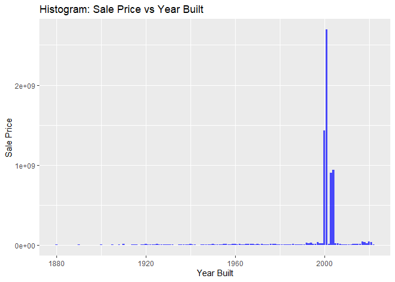

<!-- README.md is generated from README.Rmd. Please edit the README.Rmd file -->

# Lab report \#2

Follow the instructions posted at
<https://ds202-at-isu.github.io/labs.html> for the lab assignment. The
work is meant to be finished during the lab time, but you have time
until Monday evening to polish things.

Include your answers in this document (Rmd file). Make sure that it
knits properly (into the md file). Upload both the Rmd and the md file
to your repository.

All submissions to the github repo will be automatically uploaded for
grading once the due date is passed. Submit a link to your repository on
Canvas (only one submission per team) to signal to the instructors that
you are done with your submission.

``` r
#remotes::install_github("heike/classdata")
library(classdata)
library(ggplot2)
```

Installing and making sure classdata is up to date

**Question 1)**

**inspect the first few lines of the data set:**

- **what variables are there? of what type are the variables? what does
  each variable mean? what do we expect their data range to be?**

``` r
head(ames)
```

    ## # A tibble: 6 × 16
    ##   `Parcel ID` Address      Style Occupancy `Sale Date` `Sale Price` `Multi Sale`
    ##   <chr>       <chr>        <fct> <fct>     <date>             <dbl> <chr>       
    ## 1 0903202160  1024 RIDGEW… 1 1/… Single-F… 2022-08-12        181900 <NA>        
    ## 2 0907428215  4503 TWAIN … 1 St… Condomin… 2022-08-04        127100 <NA>        
    ## 3 0909428070  2030 MCCART… 1 St… Single-F… 2022-08-15             0 <NA>        
    ## 4 0923203160  3404 EMERAL… 1 St… Townhouse 2022-08-09        245000 <NA>        
    ## 5 0520440010  4507 EVERES… <NA>  <NA>      2022-08-03        449664 <NA>        
    ## 6 0907275030  4512 HEMING… 2 St… Single-F… 2022-08-16        368000 <NA>        
    ## # ℹ 9 more variables: YearBuilt <dbl>, Acres <dbl>,
    ## #   `TotalLivingArea (sf)` <dbl>, Bedrooms <dbl>,
    ## #   `FinishedBsmtArea (sf)` <dbl>, `LotArea(sf)` <dbl>, AC <chr>,
    ## #   FirePlace <chr>, Neighborhood <fct>

``` r
summary(ames)
```

    ##   Parcel ID           Address                        Style     
    ##  Length:6935        Length:6935        1 Story Frame    :3732  
    ##  Class :character   Class :character   2 Story Frame    :1456  
    ##  Mode  :character   Mode  :character   1 1/2 Story Frame: 711  
    ##                                        Split Level Frame: 215  
    ##                                        Split Foyer Frame: 156  
    ##                                        (Other)          : 218  
    ##                                        NA's             : 447  
    ##                           Occupancy      Sale Date            Sale Price      
    ##  Condominium                   : 711   Min.   :2017-07-03   Min.   :       0  
    ##  Single-Family / Owner Occupied:4711   1st Qu.:2019-03-27   1st Qu.:       0  
    ##  Townhouse                     : 745   Median :2020-09-22   Median :  170900  
    ##  Two-Family Conversion         : 139   Mean   :2020-06-14   Mean   : 1017479  
    ##  Two-Family Duplex             : 182   3rd Qu.:2021-10-14   3rd Qu.:  280000  
    ##  NA's                          : 447   Max.   :2022-08-31   Max.   :20500000  
    ##                                                                               
    ##   Multi Sale          YearBuilt        Acres         TotalLivingArea (sf)
    ##  Length:6935        Min.   :   0   Min.   : 0.0000   Min.   :   0        
    ##  Class :character   1st Qu.:1956   1st Qu.: 0.1502   1st Qu.:1095        
    ##  Mode  :character   Median :1978   Median : 0.2200   Median :1460        
    ##                     Mean   :1976   Mean   : 0.2631   Mean   :1507        
    ##                     3rd Qu.:2002   3rd Qu.: 0.2770   3rd Qu.:1792        
    ##                     Max.   :2022   Max.   :12.0120   Max.   :6007        
    ##                     NA's   :447    NA's   :89        NA's   :447         
    ##     Bedrooms      FinishedBsmtArea (sf)  LotArea(sf)          AC           
    ##  Min.   : 0.000   Min.   :  10.0        Min.   :     0   Length:6935       
    ##  1st Qu.: 3.000   1st Qu.: 474.0        1st Qu.:  6553   Class :character  
    ##  Median : 3.000   Median : 727.0        Median :  9575   Mode  :character  
    ##  Mean   : 3.299   Mean   : 776.7        Mean   : 11466                     
    ##  3rd Qu.: 4.000   3rd Qu.:1011.0        3rd Qu.: 12088                     
    ##  Max.   :10.000   Max.   :6496.0        Max.   :523228                     
    ##  NA's   :447      NA's   :2682          NA's   :89                         
    ##   FirePlace                            Neighborhood 
    ##  Length:6935        (27) Res: N Ames         : 854  
    ##  Class :character   (37) Res: College Creek  : 652  
    ##  Mode  :character   (57) Res: Investor Owned : 474  
    ##                     (29) Res: Old Town       : 469  
    ##                     (34) Res: Edwards        : 444  
    ##                     (19) Res: North Ridge Hei: 420  
    ##                     (Other)                  :3622

There are 16 variables and they include: Parcel ID, Address, Style,
Occupancy, Sale Date, Sale Price, Multi Sale, Year Built, Acres, Total
Living Area, Bedrooms, Finished Basement Area, Lot Area, AC, Fireplace,
Neighborhood.

**Variable Type:**

Parcel ID: Character

Address: Character

Style: Factor

Occupancy: Factor

Sale Date: Date

Sale Price: Double

Multi Sale: Character

Year Built: Double

Acres: Double

Total Living Area: Double

Bedrooms: Double

Finished Basement Area: Double

Lot Area: Double

AC: Character

Fireplace: Character

Neighborhood: Factor

**Meaning of Variable:**

Parcel ID:  
character with ID.

Address:  
property address in Ames, IA.

Style:  
factor variable detailing the type of housing.

Occupancy:  
factor variable of type of housing.

Sale Date:  
date of sale.

Sale Price:  
sales price (in US dollar).

Multi Sale:  
logical value: was this sale part of a package?

YearBuilt:  
integer value: year in which the house was built.

Acres:  
acres of the lot.

TotalLivingArea (sf):  
total living area in square feet.

Bedrooms:  
number of bedrooms.

FinishedBsmtArea (sf):  
total area of the finished basement in square feet.

LotArea(sf):  
total lot area in square feet.

AC:  
logical value: does the property have an AC?

FirePlace:  
logical value: does the property have an fireplace?

Neighborhood:  
factor variable - levels indicate neighborhood area in Ames.

**Expected Range:**

This can be found in the summary output by subtracting the minimum from
the maximum values for each applicable variable (some variable types do
not have a range) in the summary output.

**Question 2)**

**is there a variable of special interest or focus?**

The special variable of focus is the sale price of the
house/condo/apartment in USD.

**Question 3)**

**start the exploration with the main variable:**

- **what is the range of the variable? draw a histogram for a numeric
  variable or a bar chart, if the variable is categorical. what is the
  general pattern? is there anything odd?**

- **follow-up on oddities: see 4**

``` r
max(ames$`Sale Price`,na.rm=TRUE)-min(ames$`Sale Price`,na.rm=TRUE)
```

    ## [1] 20500000

The range for the sale price is 20500000 USD.

``` r
ggplot(ames, aes(x = `Sale Price`)) + 
  geom_histogram() +
  ggtitle("Sale Price")
```

    ## `stat_bin()` using `bins = 30`. Pick better value with `binwidth`.

<!-- -->

There is a lot of variance and a few outliners as there is large cluster
near the y axis and a few outliers as you move right.

**Question 4)**

**pick a variable that might be related to the main variable.**

- **what is the range of that variable? plot. describe the pattern.**

- **what is the relationship to the main variable? plot a scatterplot,
  boxplot or facetted barcharts (dependening on the types of variables
  involved). Describe overall pattern, does this variable describe any
  oddities discovered in 3? Identify/follow-up on any oddities.**

**Cassie Bedrooms:**

``` r
max(ames$`Bedrooms`,na.rm=TRUE)-min(ames$`Bedrooms`,na.rm=TRUE)
```

    ## [1] 10

``` r
max(ames$`Bedrooms`,na.rm=TRUE)
```

    ## [1] 10

``` r
min(ames$`Bedrooms`,na.rm=TRUE)
```

    ## [1] 0

The range of Bedrooms is 10.

``` r
ggplot(data = ames, aes(x = factor(`Bedrooms`) , y = `Sale Price`)) +
  geom_boxplot()
```

<!-- -->

This box-plot shows that there is not a large correlation between number
of bedrooms and sale price. It would likely be better if it was included
as a variable in a multiple linear regression to identify how exactly it
impacts (or doesn’t) impact sale price.
