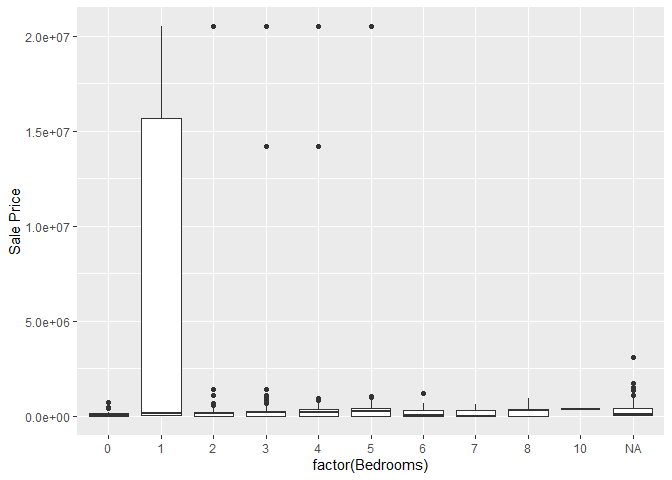
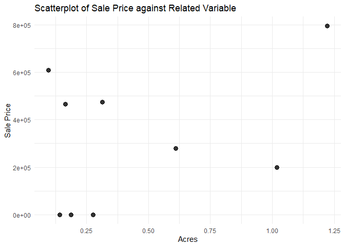

<!-- README.md is generated from README.Rmd. Please edit the README.Rmd file -->

# Lab report \#2

Follow the instructions posted at
<https://ds202-at-isu.github.io/labs.html> for the lab assignment. The
work is meant to be finished during the lab time, but you have time
until Monday evening to polish things.

Include your answers in this document (Rmd file). Make sure that it
knits properly (into the md file). Upload both the Rmd and the md file
to your repository.

All submissions to the github repo will be automatically uploaded for
grading once the due date is passed. Submit a link to your repository on
Canvas (only one submission per team) to signal to the instructors that
you are done with your submission.

``` r
#remotes::install_github("heike/classdata")
library(classdata)
```

``` r
head(ames)
```

    ##    Parcel ID                       Address             Style
    ## 1 0903202160      1024 RIDGEWOOD AVE, AMES 1 1/2 Story Frame
    ## 2 0907428215 4503 TWAIN CIR UNIT 105, AMES     1 Story Frame
    ## 3 0909428070        2030 MCCARTHY RD, AMES     1 Story Frame
    ## 4 0923203160         3404 EMERALD DR, AMES     1 Story Frame
    ## 5 0520440010       4507 EVEREST  AVE, AMES              <NA>
    ## 6 0907275030       4512 HEMINGWAY DR, AMES     2 Story Frame
    ##                        Occupancy  Sale Date Sale Price Multi Sale YearBuilt
    ## 1 Single-Family / Owner Occupied 2022-08-12     181900       <NA>      1940
    ## 2                    Condominium 2022-08-04     127100       <NA>      2006
    ## 3 Single-Family / Owner Occupied 2022-08-15          0       <NA>      1951
    ## 4                      Townhouse 2022-08-09     245000       <NA>      1997
    ## 5                           <NA> 2022-08-03     449664       <NA>        NA
    ## 6 Single-Family / Owner Occupied 2022-08-16     368000       <NA>      1996
    ##   Acres TotalLivingArea (sf) Bedrooms FinishedBsmtArea (sf) LotArea(sf)  AC
    ## 1 0.109                 1030        2                    NA        4740 Yes
    ## 2 0.027                  771        1                    NA        1181 Yes
    ## 3 0.321                 1456        3                  1261       14000 Yes
    ## 4 0.103                 1289        4                   890        4500 Yes
    ## 5 0.287                   NA       NA                    NA       12493  No
    ## 6 0.494                 2223        4                    NA       21533 Yes
    ##   FirePlace              Neighborhood
    ## 1       Yes       (28) Res: Brookside
    ## 2        No    (55) Res: Dakota Ridge
    ## 3        No        (32) Res: Crawford
    ## 4        No        (31) Res: Mitchell
    ## 5        No (19) Res: North Ridge Hei
    ## 6       Yes   (37) Res: College Creek

There are 16 variables in the Ames data set. Some variables are
categorical and others are numerical.

``` r
str(ames)
```

    ## Classes 'tbl_df', 'tbl' and 'data.frame':    6935 obs. of  16 variables:
    ##  $ Parcel ID            : chr  "0903202160" "0907428215" "0909428070" "0923203160" ...
    ##  $ Address              : chr  "1024 RIDGEWOOD AVE, AMES" "4503 TWAIN CIR UNIT 105, AMES" "2030 MCCARTHY RD, AMES" "3404 EMERALD DR, AMES" ...
    ##  $ Style                : Factor w/ 12 levels "1 1/2 Story Brick",..: 2 5 5 5 NA 9 5 5 5 5 ...
    ##  $ Occupancy            : Factor w/ 5 levels "Condominium",..: 2 1 2 3 NA 2 2 1 2 2 ...
    ##  $ Sale Date            : Date, format: "2022-08-12" "2022-08-04" ...
    ##  $ Sale Price           : num  181900 127100 0 245000 449664 ...
    ##  $ Multi Sale           : chr  NA NA NA NA ...
    ##  $ YearBuilt            : num  1940 2006 1951 1997 NA ...
    ##  $ Acres                : num  0.109 0.027 0.321 0.103 0.287 0.494 0.172 0.023 0.285 0.172 ...
    ##  $ TotalLivingArea (sf) : num  1030 771 1456 1289 NA ...
    ##  $ Bedrooms             : num  2 1 3 4 NA 4 5 1 3 4 ...
    ##  $ FinishedBsmtArea (sf): num  NA NA 1261 890 NA ...
    ##  $ LotArea(sf)          : num  4740 1181 14000 4500 12493 ...
    ##  $ AC                   : chr  "Yes" "Yes" "Yes" "Yes" ...
    ##  $ FirePlace            : chr  "Yes" "No" "No" "No" ...
    ##  $ Neighborhood         : Factor w/ 42 levels "(0) None","(13) Apts: Campus",..: 15 40 19 18 6 24 14 40 13 23 ...

``` r
library(ggplot2)
ames
```

    ## # A tibble: 6,935 × 16
    ##    `Parcel ID` Address     Style Occupancy `Sale Date` `Sale Price` `Multi Sale`
    ##    <chr>       <chr>       <fct> <fct>     <date>             <dbl> <chr>       
    ##  1 0903202160  1024 RIDGE… 1 1/… Single-F… 2022-08-12        181900 <NA>        
    ##  2 0907428215  4503 TWAIN… 1 St… Condomin… 2022-08-04        127100 <NA>        
    ##  3 0909428070  2030 MCCAR… 1 St… Single-F… 2022-08-15             0 <NA>        
    ##  4 0923203160  3404 EMERA… 1 St… Townhouse 2022-08-09        245000 <NA>        
    ##  5 0520440010  4507 EVERE… <NA>  <NA>      2022-08-03        449664 <NA>        
    ##  6 0907275030  4512 HEMIN… 2 St… Single-F… 2022-08-16        368000 <NA>        
    ##  7 0535105180  511 25TH S… 1 St… Single-F… 2022-08-03             0 <NA>        
    ##  8 0907428446  4510 TWAIN… 1 St… Condomin… 2022-08-16        110000 <NA>        
    ##  9 0527301030  3409 EISEN… 1 St… Single-F… 2022-08-08        350000 <NA>        
    ## 10 0531363050  5426 KANSA… 1 St… Single-F… 2022-08-03        242000 <NA>        
    ## # ℹ 6,925 more rows
    ## # ℹ 9 more variables: YearBuilt <dbl>, Acres <dbl>,
    ## #   `TotalLivingArea (sf)` <dbl>, Bedrooms <dbl>,
    ## #   `FinishedBsmtArea (sf)` <dbl>, `LotArea(sf)` <dbl>, AC <chr>,
    ## #   FirePlace <chr>, Neighborhood <fct>

``` r
# View(ames)
library(tidyverse)
```

    ## ── Attaching core tidyverse packages ──────────────────────── tidyverse 2.0.0 ──
    ## ✔ dplyr     1.1.4     ✔ readr     2.1.5
    ## ✔ forcats   1.0.0     ✔ stringr   1.5.1
    ## ✔ lubridate 1.9.3     ✔ tibble    3.2.1
    ## ✔ purrr     1.0.2     ✔ tidyr     1.3.1
    ## ── Conflicts ────────────────────────────────────────── tidyverse_conflicts() ──
    ## ✖ dplyr::filter() masks stats::filter()
    ## ✖ dplyr::lag()    masks stats::lag()
    ## ℹ Use the conflicted package (<http://conflicted.r-lib.org/>) to force all conflicts to become errors

``` r
str(ames)
```

    ## tibble [6,935 × 16] (S3: tbl_df/tbl/data.frame)
    ##  $ Parcel ID            : chr [1:6935] "0903202160" "0907428215" "0909428070" "0923203160" ...
    ##  $ Address              : chr [1:6935] "1024 RIDGEWOOD AVE, AMES" "4503 TWAIN CIR UNIT 105, AMES" "2030 MCCARTHY RD, AMES" "3404 EMERALD DR, AMES" ...
    ##  $ Style                : Factor w/ 12 levels "1 1/2 Story Brick",..: 2 5 5 5 NA 9 5 5 5 5 ...
    ##  $ Occupancy            : Factor w/ 5 levels "Condominium",..: 2 1 2 3 NA 2 2 1 2 2 ...
    ##  $ Sale Date            : Date[1:6935], format: "2022-08-12" "2022-08-04" ...
    ##  $ Sale Price           : num [1:6935] 181900 127100 0 245000 449664 ...
    ##  $ Multi Sale           : chr [1:6935] NA NA NA NA ...
    ##  $ YearBuilt            : num [1:6935] 1940 2006 1951 1997 NA ...
    ##  $ Acres                : num [1:6935] 0.109 0.027 0.321 0.103 0.287 0.494 0.172 0.023 0.285 0.172 ...
    ##  $ TotalLivingArea (sf) : num [1:6935] 1030 771 1456 1289 NA ...
    ##  $ Bedrooms             : num [1:6935] 2 1 3 4 NA 4 5 1 3 4 ...
    ##  $ FinishedBsmtArea (sf): num [1:6935] NA NA 1261 890 NA ...
    ##  $ LotArea(sf)          : num [1:6935] 4740 1181 14000 4500 12493 ...
    ##  $ AC                   : chr [1:6935] "Yes" "Yes" "Yes" "Yes" ...
    ##  $ FirePlace            : chr [1:6935] "Yes" "No" "No" "No" ...
    ##  $ Neighborhood         : Factor w/ 42 levels "(0) None","(13) Apts: Campus",..: 15 40 19 18 6 24 14 40 13 23 ...

``` r
ames_filtered <- ames %>%
  filter(YearBuilt >= 1880 & YearBuilt <= 2022)
  
# View(ames_filtered)
  
ggplot(ames_filtered, aes(x = YearBuilt, y = `Sale Price`)) +
  geom_histogram(stat = "identity", fill = "blue", alpha = 0.7) +  
  labs(title = "Histogram: Sale Price vs Year Built",
       x = "Year Built",
       y = "Sale Price")
```

    ## Warning in geom_histogram(stat = "identity", fill = "blue", alpha = 0.7):
    ## Ignoring unknown parameters: `binwidth`, `bins`, and `pad`

<!-- -->

``` r
theme_minimal()
```

    ## List of 97
    ##  $ line                      :List of 6
    ##   ..$ colour       : chr "black"
    ##   ..$ linewidth    : num 0.5
    ##   ..$ linetype     : num 1
    ##   ..$ lineend      : chr "butt"
    ##   ..$ arrow        : logi FALSE
    ##   ..$ inherit.blank: logi TRUE
    ##   ..- attr(*, "class")= chr [1:2] "element_line" "element"
    ##  $ rect                      :List of 5
    ##   ..$ fill         : chr "white"
    ##   ..$ colour       : chr "black"
    ##   ..$ linewidth    : num 0.5
    ##   ..$ linetype     : num 1
    ##   ..$ inherit.blank: logi TRUE
    ##   ..- attr(*, "class")= chr [1:2] "element_rect" "element"
    ##  $ text                      :List of 11
    ##   ..$ family       : chr ""
    ##   ..$ face         : chr "plain"
    ##   ..$ colour       : chr "black"
    ##   ..$ size         : num 11
    ##   ..$ hjust        : num 0.5
    ##   ..$ vjust        : num 0.5
    ##   ..$ angle        : num 0
    ##   ..$ lineheight   : num 0.9
    ##   ..$ margin       : 'margin' num [1:4] 0points 0points 0points 0points
    ##   .. ..- attr(*, "unit")= int 8
    ##   ..$ debug        : logi FALSE
    ##   ..$ inherit.blank: logi TRUE
    ##   ..- attr(*, "class")= chr [1:2] "element_text" "element"
    ##  $ title                     : NULL
    ##  $ aspect.ratio              : NULL
    ##  $ axis.title                : NULL
    ##  $ axis.title.x              :List of 11
    ##   ..$ family       : NULL
    ##   ..$ face         : NULL
    ##   ..$ colour       : NULL
    ##   ..$ size         : NULL
    ##   ..$ hjust        : NULL
    ##   ..$ vjust        : num 1
    ##   ..$ angle        : NULL
    ##   ..$ lineheight   : NULL
    ##   ..$ margin       : 'margin' num [1:4] 2.75points 0points 0points 0points
    ##   .. ..- attr(*, "unit")= int 8
    ##   ..$ debug        : NULL
    ##   ..$ inherit.blank: logi TRUE
    ##   ..- attr(*, "class")= chr [1:2] "element_text" "element"
    ##  $ axis.title.x.top          :List of 11
    ##   ..$ family       : NULL
    ##   ..$ face         : NULL
    ##   ..$ colour       : NULL
    ##   ..$ size         : NULL
    ##   ..$ hjust        : NULL
    ##   ..$ vjust        : num 0
    ##   ..$ angle        : NULL
    ##   ..$ lineheight   : NULL
    ##   ..$ margin       : 'margin' num [1:4] 0points 0points 2.75points 0points
    ##   .. ..- attr(*, "unit")= int 8
    ##   ..$ debug        : NULL
    ##   ..$ inherit.blank: logi TRUE
    ##   ..- attr(*, "class")= chr [1:2] "element_text" "element"
    ##  $ axis.title.x.bottom       : NULL
    ##  $ axis.title.y              :List of 11
    ##   ..$ family       : NULL
    ##   ..$ face         : NULL
    ##   ..$ colour       : NULL
    ##   ..$ size         : NULL
    ##   ..$ hjust        : NULL
    ##   ..$ vjust        : num 1
    ##   ..$ angle        : num 90
    ##   ..$ lineheight   : NULL
    ##   ..$ margin       : 'margin' num [1:4] 0points 2.75points 0points 0points
    ##   .. ..- attr(*, "unit")= int 8
    ##   ..$ debug        : NULL
    ##   ..$ inherit.blank: logi TRUE
    ##   ..- attr(*, "class")= chr [1:2] "element_text" "element"
    ##  $ axis.title.y.left         : NULL
    ##  $ axis.title.y.right        :List of 11
    ##   ..$ family       : NULL
    ##   ..$ face         : NULL
    ##   ..$ colour       : NULL
    ##   ..$ size         : NULL
    ##   ..$ hjust        : NULL
    ##   ..$ vjust        : num 0
    ##   ..$ angle        : num -90
    ##   ..$ lineheight   : NULL
    ##   ..$ margin       : 'margin' num [1:4] 0points 0points 0points 2.75points
    ##   .. ..- attr(*, "unit")= int 8
    ##   ..$ debug        : NULL
    ##   ..$ inherit.blank: logi TRUE
    ##   ..- attr(*, "class")= chr [1:2] "element_text" "element"
    ##  $ axis.text                 :List of 11
    ##   ..$ family       : NULL
    ##   ..$ face         : NULL
    ##   ..$ colour       : chr "grey30"
    ##   ..$ size         : 'rel' num 0.8
    ##   ..$ hjust        : NULL
    ##   ..$ vjust        : NULL
    ##   ..$ angle        : NULL
    ##   ..$ lineheight   : NULL
    ##   ..$ margin       : NULL
    ##   ..$ debug        : NULL
    ##   ..$ inherit.blank: logi TRUE
    ##   ..- attr(*, "class")= chr [1:2] "element_text" "element"
    ##  $ axis.text.x               :List of 11
    ##   ..$ family       : NULL
    ##   ..$ face         : NULL
    ##   ..$ colour       : NULL
    ##   ..$ size         : NULL
    ##   ..$ hjust        : NULL
    ##   ..$ vjust        : num 1
    ##   ..$ angle        : NULL
    ##   ..$ lineheight   : NULL
    ##   ..$ margin       : 'margin' num [1:4] 2.2points 0points 0points 0points
    ##   .. ..- attr(*, "unit")= int 8
    ##   ..$ debug        : NULL
    ##   ..$ inherit.blank: logi TRUE
    ##   ..- attr(*, "class")= chr [1:2] "element_text" "element"
    ##  $ axis.text.x.top           :List of 11
    ##   ..$ family       : NULL
    ##   ..$ face         : NULL
    ##   ..$ colour       : NULL
    ##   ..$ size         : NULL
    ##   ..$ hjust        : NULL
    ##   ..$ vjust        : num 0
    ##   ..$ angle        : NULL
    ##   ..$ lineheight   : NULL
    ##   ..$ margin       : 'margin' num [1:4] 0points 0points 2.2points 0points
    ##   .. ..- attr(*, "unit")= int 8
    ##   ..$ debug        : NULL
    ##   ..$ inherit.blank: logi TRUE
    ##   ..- attr(*, "class")= chr [1:2] "element_text" "element"
    ##  $ axis.text.x.bottom        : NULL
    ##  $ axis.text.y               :List of 11
    ##   ..$ family       : NULL
    ##   ..$ face         : NULL
    ##   ..$ colour       : NULL
    ##   ..$ size         : NULL
    ##   ..$ hjust        : num 1
    ##   ..$ vjust        : NULL
    ##   ..$ angle        : NULL
    ##   ..$ lineheight   : NULL
    ##   ..$ margin       : 'margin' num [1:4] 0points 2.2points 0points 0points
    ##   .. ..- attr(*, "unit")= int 8
    ##   ..$ debug        : NULL
    ##   ..$ inherit.blank: logi TRUE
    ##   ..- attr(*, "class")= chr [1:2] "element_text" "element"
    ##  $ axis.text.y.left          : NULL
    ##  $ axis.text.y.right         :List of 11
    ##   ..$ family       : NULL
    ##   ..$ face         : NULL
    ##   ..$ colour       : NULL
    ##   ..$ size         : NULL
    ##   ..$ hjust        : num 0
    ##   ..$ vjust        : NULL
    ##   ..$ angle        : NULL
    ##   ..$ lineheight   : NULL
    ##   ..$ margin       : 'margin' num [1:4] 0points 0points 0points 2.2points
    ##   .. ..- attr(*, "unit")= int 8
    ##   ..$ debug        : NULL
    ##   ..$ inherit.blank: logi TRUE
    ##   ..- attr(*, "class")= chr [1:2] "element_text" "element"
    ##  $ axis.ticks                : list()
    ##   ..- attr(*, "class")= chr [1:2] "element_blank" "element"
    ##  $ axis.ticks.x              : NULL
    ##  $ axis.ticks.x.top          : NULL
    ##  $ axis.ticks.x.bottom       : NULL
    ##  $ axis.ticks.y              : NULL
    ##  $ axis.ticks.y.left         : NULL
    ##  $ axis.ticks.y.right        : NULL
    ##  $ axis.ticks.length         : 'simpleUnit' num 2.75points
    ##   ..- attr(*, "unit")= int 8
    ##  $ axis.ticks.length.x       : NULL
    ##  $ axis.ticks.length.x.top   : NULL
    ##  $ axis.ticks.length.x.bottom: NULL
    ##  $ axis.ticks.length.y       : NULL
    ##  $ axis.ticks.length.y.left  : NULL
    ##  $ axis.ticks.length.y.right : NULL
    ##  $ axis.line                 : list()
    ##   ..- attr(*, "class")= chr [1:2] "element_blank" "element"
    ##  $ axis.line.x               : NULL
    ##  $ axis.line.x.top           : NULL
    ##  $ axis.line.x.bottom        : NULL
    ##  $ axis.line.y               : NULL
    ##  $ axis.line.y.left          : NULL
    ##  $ axis.line.y.right         : NULL
    ##  $ legend.background         : list()
    ##   ..- attr(*, "class")= chr [1:2] "element_blank" "element"
    ##  $ legend.margin             : 'margin' num [1:4] 5.5points 5.5points 5.5points 5.5points
    ##   ..- attr(*, "unit")= int 8
    ##  $ legend.spacing            : 'simpleUnit' num 11points
    ##   ..- attr(*, "unit")= int 8
    ##  $ legend.spacing.x          : NULL
    ##  $ legend.spacing.y          : NULL
    ##  $ legend.key                : list()
    ##   ..- attr(*, "class")= chr [1:2] "element_blank" "element"
    ##  $ legend.key.size           : 'simpleUnit' num 1.2lines
    ##   ..- attr(*, "unit")= int 3
    ##  $ legend.key.height         : NULL
    ##  $ legend.key.width          : NULL
    ##  $ legend.text               :List of 11
    ##   ..$ family       : NULL
    ##   ..$ face         : NULL
    ##   ..$ colour       : NULL
    ##   ..$ size         : 'rel' num 0.8
    ##   ..$ hjust        : NULL
    ##   ..$ vjust        : NULL
    ##   ..$ angle        : NULL
    ##   ..$ lineheight   : NULL
    ##   ..$ margin       : NULL
    ##   ..$ debug        : NULL
    ##   ..$ inherit.blank: logi TRUE
    ##   ..- attr(*, "class")= chr [1:2] "element_text" "element"
    ##  $ legend.text.align         : NULL
    ##  $ legend.title              :List of 11
    ##   ..$ family       : NULL
    ##   ..$ face         : NULL
    ##   ..$ colour       : NULL
    ##   ..$ size         : NULL
    ##   ..$ hjust        : num 0
    ##   ..$ vjust        : NULL
    ##   ..$ angle        : NULL
    ##   ..$ lineheight   : NULL
    ##   ..$ margin       : NULL
    ##   ..$ debug        : NULL
    ##   ..$ inherit.blank: logi TRUE
    ##   ..- attr(*, "class")= chr [1:2] "element_text" "element"
    ##  $ legend.title.align        : NULL
    ##  $ legend.position           : chr "right"
    ##  $ legend.direction          : NULL
    ##  $ legend.justification      : chr "center"
    ##  $ legend.box                : NULL
    ##  $ legend.box.just           : NULL
    ##  $ legend.box.margin         : 'margin' num [1:4] 0cm 0cm 0cm 0cm
    ##   ..- attr(*, "unit")= int 1
    ##  $ legend.box.background     : list()
    ##   ..- attr(*, "class")= chr [1:2] "element_blank" "element"
    ##  $ legend.box.spacing        : 'simpleUnit' num 11points
    ##   ..- attr(*, "unit")= int 8
    ##  $ panel.background          : list()
    ##   ..- attr(*, "class")= chr [1:2] "element_blank" "element"
    ##  $ panel.border              : list()
    ##   ..- attr(*, "class")= chr [1:2] "element_blank" "element"
    ##  $ panel.spacing             : 'simpleUnit' num 5.5points
    ##   ..- attr(*, "unit")= int 8
    ##  $ panel.spacing.x           : NULL
    ##  $ panel.spacing.y           : NULL
    ##  $ panel.grid                :List of 6
    ##   ..$ colour       : chr "grey92"
    ##   ..$ linewidth    : NULL
    ##   ..$ linetype     : NULL
    ##   ..$ lineend      : NULL
    ##   ..$ arrow        : logi FALSE
    ##   ..$ inherit.blank: logi TRUE
    ##   ..- attr(*, "class")= chr [1:2] "element_line" "element"
    ##  $ panel.grid.major          : NULL
    ##  $ panel.grid.minor          :List of 6
    ##   ..$ colour       : NULL
    ##   ..$ linewidth    : 'rel' num 0.5
    ##   ..$ linetype     : NULL
    ##   ..$ lineend      : NULL
    ##   ..$ arrow        : logi FALSE
    ##   ..$ inherit.blank: logi TRUE
    ##   ..- attr(*, "class")= chr [1:2] "element_line" "element"
    ##  $ panel.grid.major.x        : NULL
    ##  $ panel.grid.major.y        : NULL
    ##  $ panel.grid.minor.x        : NULL
    ##  $ panel.grid.minor.y        : NULL
    ##  $ panel.ontop               : logi FALSE
    ##  $ plot.background           : list()
    ##   ..- attr(*, "class")= chr [1:2] "element_blank" "element"
    ##  $ plot.title                :List of 11
    ##   ..$ family       : NULL
    ##   ..$ face         : NULL
    ##   ..$ colour       : NULL
    ##   ..$ size         : 'rel' num 1.2
    ##   ..$ hjust        : num 0
    ##   ..$ vjust        : num 1
    ##   ..$ angle        : NULL
    ##   ..$ lineheight   : NULL
    ##   ..$ margin       : 'margin' num [1:4] 0points 0points 5.5points 0points
    ##   .. ..- attr(*, "unit")= int 8
    ##   ..$ debug        : NULL
    ##   ..$ inherit.blank: logi TRUE
    ##   ..- attr(*, "class")= chr [1:2] "element_text" "element"
    ##  $ plot.title.position       : chr "panel"
    ##  $ plot.subtitle             :List of 11
    ##   ..$ family       : NULL
    ##   ..$ face         : NULL
    ##   ..$ colour       : NULL
    ##   ..$ size         : NULL
    ##   ..$ hjust        : num 0
    ##   ..$ vjust        : num 1
    ##   ..$ angle        : NULL
    ##   ..$ lineheight   : NULL
    ##   ..$ margin       : 'margin' num [1:4] 0points 0points 5.5points 0points
    ##   .. ..- attr(*, "unit")= int 8
    ##   ..$ debug        : NULL
    ##   ..$ inherit.blank: logi TRUE
    ##   ..- attr(*, "class")= chr [1:2] "element_text" "element"
    ##  $ plot.caption              :List of 11
    ##   ..$ family       : NULL
    ##   ..$ face         : NULL
    ##   ..$ colour       : NULL
    ##   ..$ size         : 'rel' num 0.8
    ##   ..$ hjust        : num 1
    ##   ..$ vjust        : num 1
    ##   ..$ angle        : NULL
    ##   ..$ lineheight   : NULL
    ##   ..$ margin       : 'margin' num [1:4] 5.5points 0points 0points 0points
    ##   .. ..- attr(*, "unit")= int 8
    ##   ..$ debug        : NULL
    ##   ..$ inherit.blank: logi TRUE
    ##   ..- attr(*, "class")= chr [1:2] "element_text" "element"
    ##  $ plot.caption.position     : chr "panel"
    ##  $ plot.tag                  :List of 11
    ##   ..$ family       : NULL
    ##   ..$ face         : NULL
    ##   ..$ colour       : NULL
    ##   ..$ size         : 'rel' num 1.2
    ##   ..$ hjust        : num 0.5
    ##   ..$ vjust        : num 0.5
    ##   ..$ angle        : NULL
    ##   ..$ lineheight   : NULL
    ##   ..$ margin       : NULL
    ##   ..$ debug        : NULL
    ##   ..$ inherit.blank: logi TRUE
    ##   ..- attr(*, "class")= chr [1:2] "element_text" "element"
    ##  $ plot.tag.position         : chr "topleft"
    ##  $ plot.margin               : 'margin' num [1:4] 5.5points 5.5points 5.5points 5.5points
    ##   ..- attr(*, "unit")= int 8
    ##  $ strip.background          : list()
    ##   ..- attr(*, "class")= chr [1:2] "element_blank" "element"
    ##  $ strip.background.x        : NULL
    ##  $ strip.background.y        : NULL
    ##  $ strip.clip                : chr "inherit"
    ##  $ strip.placement           : chr "inside"
    ##  $ strip.text                :List of 11
    ##   ..$ family       : NULL
    ##   ..$ face         : NULL
    ##   ..$ colour       : chr "grey10"
    ##   ..$ size         : 'rel' num 0.8
    ##   ..$ hjust        : NULL
    ##   ..$ vjust        : NULL
    ##   ..$ angle        : NULL
    ##   ..$ lineheight   : NULL
    ##   ..$ margin       : 'margin' num [1:4] 4.4points 4.4points 4.4points 4.4points
    ##   .. ..- attr(*, "unit")= int 8
    ##   ..$ debug        : NULL
    ##   ..$ inherit.blank: logi TRUE
    ##   ..- attr(*, "class")= chr [1:2] "element_text" "element"
    ##  $ strip.text.x              : NULL
    ##  $ strip.text.x.bottom       : NULL
    ##  $ strip.text.x.top          : NULL
    ##  $ strip.text.y              :List of 11
    ##   ..$ family       : NULL
    ##   ..$ face         : NULL
    ##   ..$ colour       : NULL
    ##   ..$ size         : NULL
    ##   ..$ hjust        : NULL
    ##   ..$ vjust        : NULL
    ##   ..$ angle        : num -90
    ##   ..$ lineheight   : NULL
    ##   ..$ margin       : NULL
    ##   ..$ debug        : NULL
    ##   ..$ inherit.blank: logi TRUE
    ##   ..- attr(*, "class")= chr [1:2] "element_text" "element"
    ##  $ strip.text.y.left         :List of 11
    ##   ..$ family       : NULL
    ##   ..$ face         : NULL
    ##   ..$ colour       : NULL
    ##   ..$ size         : NULL
    ##   ..$ hjust        : NULL
    ##   ..$ vjust        : NULL
    ##   ..$ angle        : num 90
    ##   ..$ lineheight   : NULL
    ##   ..$ margin       : NULL
    ##   ..$ debug        : NULL
    ##   ..$ inherit.blank: logi TRUE
    ##   ..- attr(*, "class")= chr [1:2] "element_text" "element"
    ##  $ strip.text.y.right        : NULL
    ##  $ strip.switch.pad.grid     : 'simpleUnit' num 2.75points
    ##   ..- attr(*, "unit")= int 8
    ##  $ strip.switch.pad.wrap     : 'simpleUnit' num 2.75points
    ##   ..- attr(*, "unit")= int 8
    ##  - attr(*, "class")= chr [1:2] "theme" "gg"
    ##  - attr(*, "complete")= logi TRUE
    ##  - attr(*, "validate")= logi TRUE

Parcel ID: Character

Address: Character

Style: Factor

Occupancy: Factor

Sale Date: Date

Sale Price: Double

Multi Sale: Character

Year Built: Double

Acres: Double

Total Living Area: Double

Bedrooms: Double

Finished Basement Area: Double

Lot Area: Double

AC: Character

Fireplace: Character

Neighborhood: Factor

**Meaning of Variable:**

Parcel ID:  
character with ID.

Address:  
property address in Ames, IA.

Style:  
factor variable detailing the type of housing.

Occupancy:  
factor variable of type of housing.

Sale Date:  
date of sale.

Sale Price:  
sales price (in US dollar).

Multi Sale:  
logical value: was this sale part of a package?

YearBuilt:  
integer value: year in which the house was built.

Acres:  
acres of the lot.

TotalLivingArea (sf):  
total living area in square feet.

Bedrooms:  
number of bedrooms.

FinishedBsmtArea (sf):  
total area of the finished basement in square feet.

LotArea(sf):  
total lot area in square feet.

AC:  
logical value: does the property have an AC?

FirePlace:  
logical value: does the property have an fireplace?

Neighborhood:  
factor variable - levels indicate neighborhood area in Ames.

**Expected Range:**

This can be found in the summary output by subtracting the minimum from
the maximum values for each applicable variable (some variable types do
not have a range) in the summary output.

**Question 2)**

**is there a variable of special interest or focus?**

The special variable of focus is the sale price of the
house/condo/apartment in USD.

**Question 3)**

**start the exploration with the main variable:**

- **what is the range of the variable? draw a histogram for a numeric
  variable or a bar chart, if the variable is categorical. what is the
  general pattern? is there anything odd?**

- **follow-up on oddities: see 4**

``` r
max(ames$`Sale Price`,na.rm=TRUE)-min(ames$`Sale Price`,na.rm=TRUE)
```

    ## [1] 20500000

The range for the sale price is 20500000 USD.

``` r
ggplot(ames, aes(x = `Sale Price`)) + 
  geom_histogram() +
  ggtitle("Sale Price")
```

    ## `stat_bin()` using `bins = 30`. Pick better value with `binwidth`.

<!-- -->

There is a lot of variance and a few outliners as there is large cluster
near the y axis and a few outliers as you move right.

``` r
#Ryan Riebesehl- I chose Acres
# remotes::install_github('heike/classdata')
library(classdata)
head(ames)
```

    ## # A tibble: 6 × 16
    ##   `Parcel ID` Address      Style Occupancy `Sale Date` `Sale Price` `Multi Sale`
    ##   <chr>       <chr>        <fct> <fct>     <date>             <dbl> <chr>       
    ## 1 0903202160  1024 RIDGEW… 1 1/… Single-F… 2022-08-12        181900 <NA>        
    ## 2 0907428215  4503 TWAIN … 1 St… Condomin… 2022-08-04        127100 <NA>        
    ## 3 0909428070  2030 MCCART… 1 St… Single-F… 2022-08-15             0 <NA>        
    ## 4 0923203160  3404 EMERAL… 1 St… Townhouse 2022-08-09        245000 <NA>        
    ## 5 0520440010  4507 EVERES… <NA>  <NA>      2022-08-03        449664 <NA>        
    ## 6 0907275030  4512 HEMING… 2 St… Single-F… 2022-08-16        368000 <NA>        
    ## # ℹ 9 more variables: YearBuilt <dbl>, Acres <dbl>,
    ## #   `TotalLivingArea (sf)` <dbl>, Bedrooms <dbl>,
    ## #   `FinishedBsmtArea (sf)` <dbl>, `LotArea(sf)` <dbl>, AC <chr>,
    ## #   FirePlace <chr>, Neighborhood <fct>

``` r
#Ryan Riebesehl- I chose Acres:

library(ggplot2)
ames1 <- na.omit(ames)
Acres <- ames1$Acres
SalePrice <- ames1$`Sale Price`
print(range(Acres))
```

    ## [1] 0.096 1.222

``` r
ggplot(ames1, aes(x = Acres, y = SalePrice)) +
  geom_point(size = 3, alpha = 0.8) +
  labs(title = "Scatterplot of Sale Price against Related Variable",
       x = "Acres",
       y = "Sale Price",
       color = "Category") +
  theme_minimal()
```

<!-- -->

^Based on the scatter plot to see differences between Acres and Sales
Price, you can see a slight trend that houses with small acres have an
expensive sales price. This is the same for houses with large amounts
Acres. This is probably because houses near the downtown city of Ames
tend to be more expensive. Additionally, large acres of land will
usually cost more money. There are some oddities in the graph as some
price have not been updated. -Ryan Riebesehl
